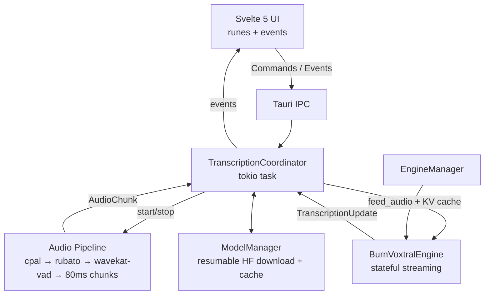

# Voxly

**Fully local, privacy-first, cross-platform realtime speech-to-text desktop application.**

[](LICENSE)
[](https://tauri.app)
[](https://svelte.dev)
[](https://www.rust-lang.org)
[]()

Voxly brings **Mistral's Voxtral Mini 4B Realtime** to your desktop. It runs 100% locally using the Burn ML framework (Q4 GGUF) with sub-second end-to-end latency. No cloud. No data leaves your machine.

## Vision

High-quality, private, realtime speech-to-text that anyone can run on their own computer — with the same attention to engineering quality, safety, and user experience as the best cloud services.

## ✨ Key Features

- **True Realtime STT** — Streaming transcription with ~480 ms (configurable 80–2400 ms) target latency
- **Fully Local & Private** — Q4 GGUF model runs entirely on-device via Burn
- **Cross-platform** — macOS & Windows primary (Linux supported)
- **Excellent Audio Pipeline** — cpal capture, rubato resampling, wavekat-vad (Silero) with dynamic trailing silence and onset protection, 80 ms overlapping chunks
- **Smart Text Handling** — Clear visual distinction between *tentative* (provisional) and committed text + simple inline editing
- **Robust Model Management** — On-demand resumable downloads from Hugging Face with progress, speed, ETA, pause/resume
- **Engine Abstraction** — Clean `TranscriptionEngine` trait so other backends can be added later
- **Professional UX** — Svelte 5 runes UI, push-to-talk + always-on modes, global hotkeys, status, settings
- **High Engineering Standards** — `tracing`, comprehensive error handling, safety guards against panics, extensive tests, CI

## 🛠 Tech Stack

| Layer                | Technology                                              |
|----------------------|---------------------------------------------------------|
| Desktop Shell        | Tauri v2                                                |
| Backend Runtime      | Rust + Tokio                                            |
| Inference            | Burn + `voxtral-mini-realtime` (TrevorS) – Q4 GGUF      |
| Audio                | cpal + rubato + wavekat-vad (Silero) + custom chunker   |
| Frontend             | Svelte 5 (runes) + SvelteKit (static adapter) + Vite + TypeScript (strict) + Tailwind |
| State & Reactivity   | Svelte 5 runes (fine-grained)                           |
| Error Handling       | `thiserror` + `anyhow`                                  |
| Logging & Observability | `tracing` + `tracing-subscriber`                     |
| Model Downloads      | Custom resumable `reqwest` + Range (with `hf-hub` support) |

## 🚀 Quick Start

### Prerequisites

- Rust (stable, with `rustfmt` + `clippy`)
- Node.js 20+ and pnpm (recommended) or npm
- macOS: Xcode command-line tools
- Windows: Visual Studio Build Tools + WebView2 runtime

### Development

```bash
git clone https://github.com/jeremymiribung-blip/voxly.git
cd voxly

# Install frontend dependencies
pnpm install

# Run the app (hot reload for both Rust and frontend)
pnpm tauri dev
```

On first launch (or if the model is missing) you will see an onboarding screen that downloads the ~2.5 GB Q4 GGUF model with progress, speed, and ETA. The download is resumable.

### Production Build

```bash
pnpm tauri build
```

The packaged app will appear under `src-tauri/target/release/bundle/`.

## Architecture Overview



See [`docs/architecture.md`](docs/architecture.md) for a deeper walkthrough and the individual ADRs in `docs/adr/`.

## Performance & Hardware

- **Target**: < 600 ms end-to-end on good hardware (model algorithmic delay is ~480 ms).
- **Model size**: ~2.5 GB (Q4 GGUF).
- **Recommended**: Modern CPU + 8 GB+ RAM. GPU (Metal / Vulkan) significantly improves inference speed when using the wgpu backend.
- Real-time factor (RTF) and latency are exposed in the UI and via events.

## Development Setup

See [CONTRIBUTING.md](CONTRIBUTING.md) for detailed instructions.

Quick checks:

```bash
# Rust
cargo fmt -- --check
cargo clippy -p voxly --all-targets -- -D warnings
cargo test -p voxly --lib

# Frontend
pnpm check

# Run
pnpm tauri dev
```

## Documentation

- Architecture Decision Records: `docs/adr/`
- High-level architecture: `docs/architecture.md`
- This README + inline code documentation

## Contributing

We follow **Conventional Commits** and have high standards for tests, error handling, and documentation.

See [CONTRIBUTING.md](CONTRIBUTING.md).

## License

Apache-2.0

---

Built with care for privacy, performance, and engineering quality.
